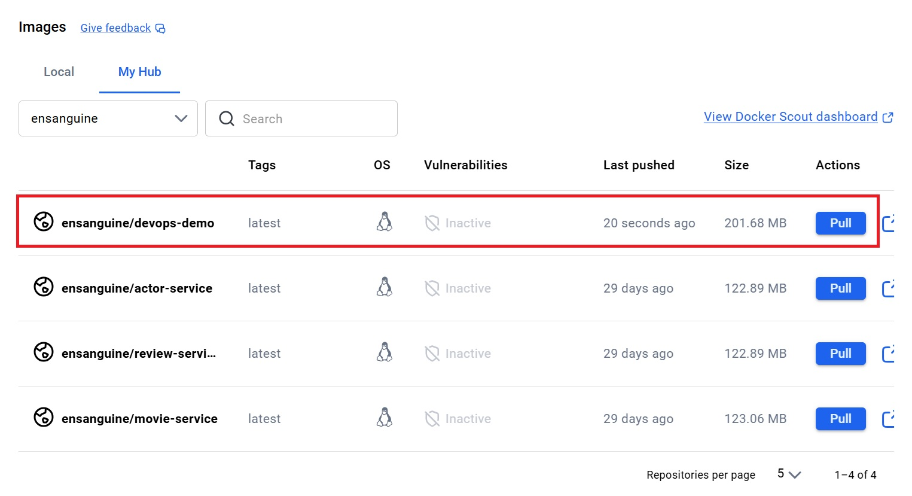
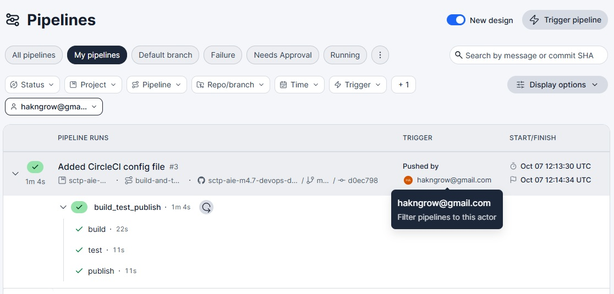

Completed devops-demo from [4.7 Continuous Integration with CircleCI](https://github.com/su-ntu-sctp/ai-4.7-Continuous-Integration/blob/main/lesson.md)

## DockerHub Images

Image `ensanguine/devops-demo` has been pushed to DockerHub. 

## Circle CI Pipelines

Circle CI `build_test_publish` pipeline completed successfully.

Added to trigger pipeline on CircleCI